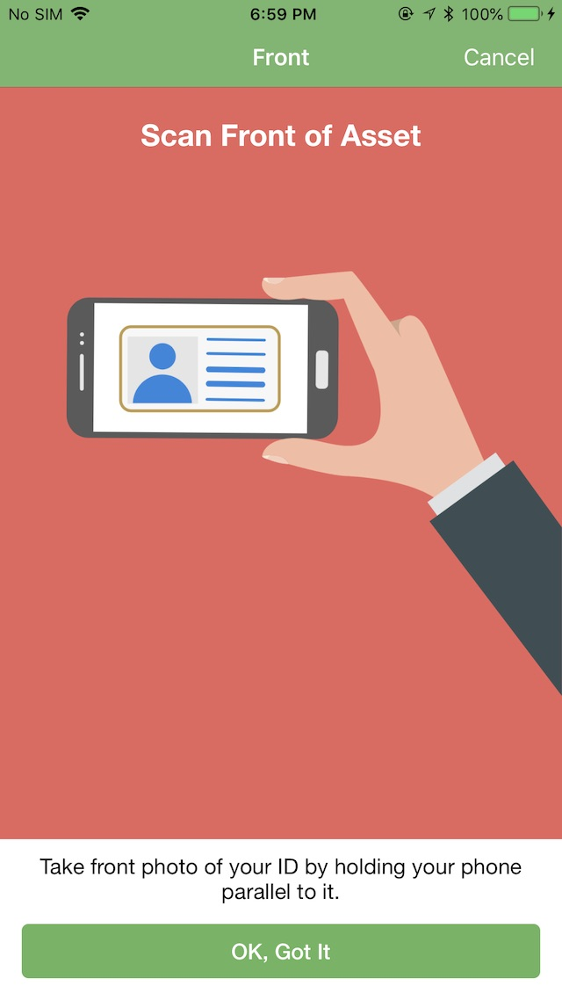
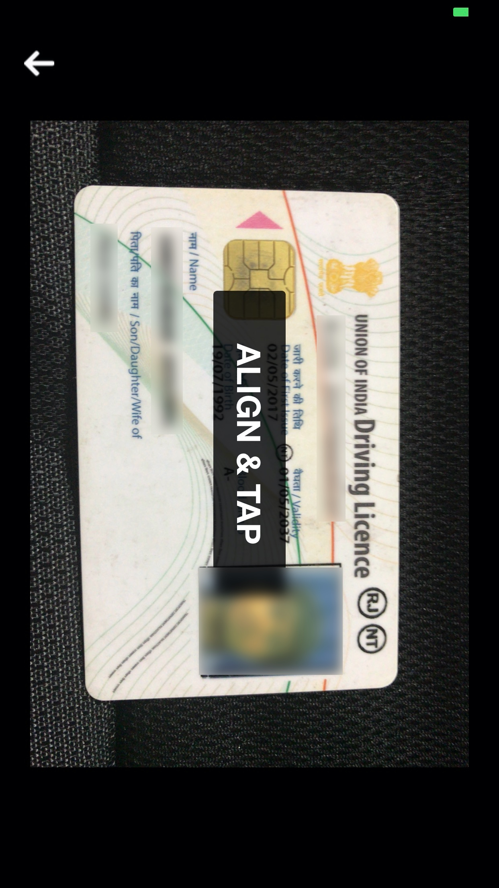
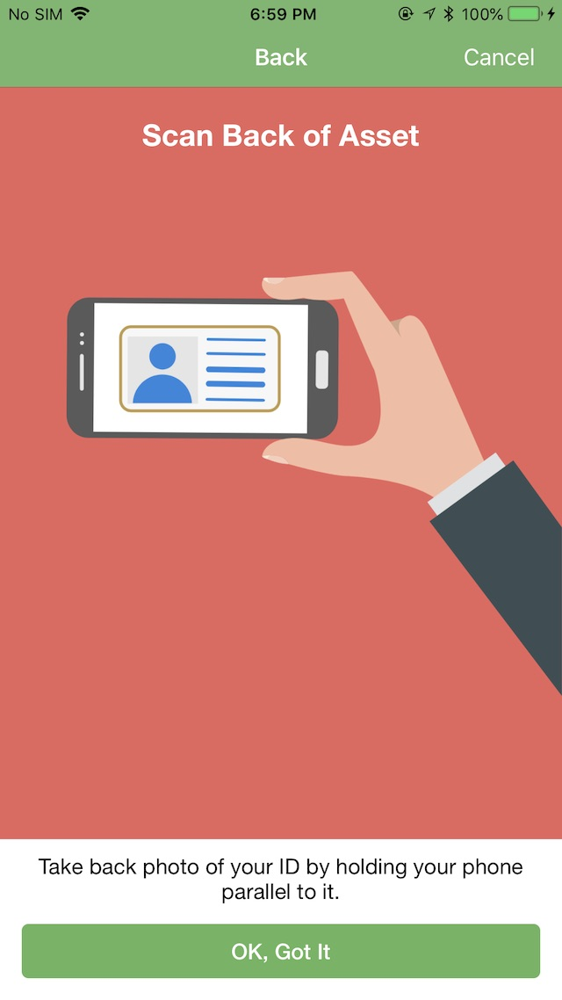
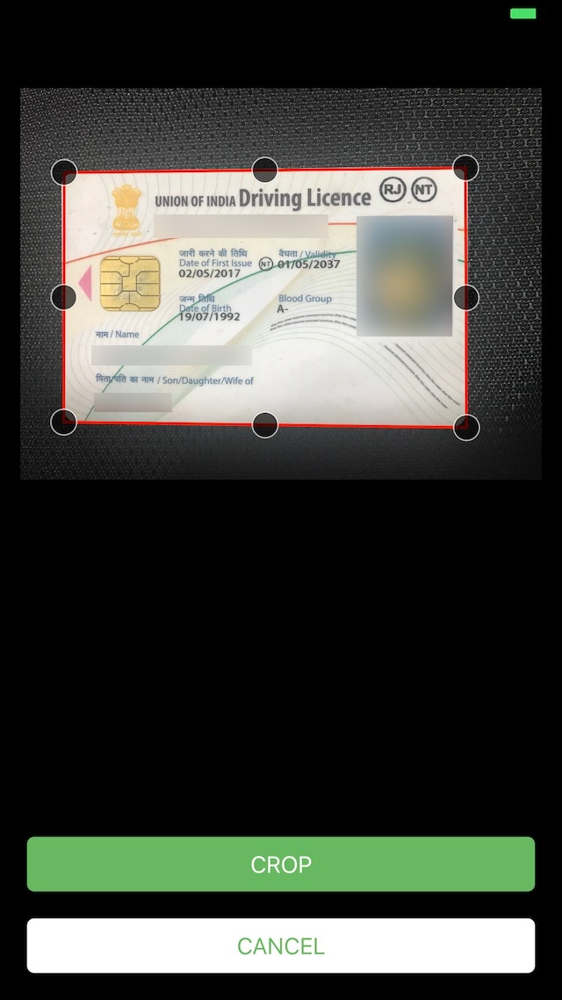

# df-documents (Document Capture SDK)

This SDK based on AVFoundationKit and OpenCV which is been created to scan, capture & crop the document.

- Capture Document from Front and Back
- Crop with Auto-Edge-Detection

Sole purpose of this SDK is to capture the snapshot of document via scan mode, even you get the functionality of auto-edge-detection, so that you can crop the images more accurately.


<b>You can achieve the functionality with easy integration of following steps:</b>

- In a new terminal window, run `pod install --repo-update` to install and update. Get [Cocoapods](https://cocoapods.org/)
*you can skip this case if you have updated pod in you mac.*

- Create the podfile in your project.
```
pod init
```

- Open the pod file from directory and add pods in podfile.
```
pod 'df-document-capture', '~> 1.0'
```

- Run command to install
```
pod install
```
<i>Now close the xcode project and open prj.xcworkspace instead.</i>


- Add your org's `DCAccessToken` token in your `Info.plist` file.

- `import DocumentCapture` in your `UIViewController` file where you want to use this feature.

- And instantiate the view with following code.

        DocumentCapture.sharedInstance.storyboardInstance(success: { [weak self] viewController in
        
            // Check whether clicking back or not
            DocumentCapture.sharedInstance.backEnable = true
            DocumentCapture.sharedInstance.navigationBarColor = .white

            DispatchQueue.main.async {
                if let vc = viewController {
                    self?.present(vc, animated: true, completion: nil)
                    }
                    }
            }, failure: { (error) in
                print(error?.userInfo ?? "Your api token is not valid")
        })

        DC.passImage = { img1, img2 in
            self.updateImages(image1: frontImage, image2: backImage)    
            self.dismiss(animated: true, completion: nil)
        }

<br>
<br>
<p align="left">


 <br>
  
Repeat the same procedure to capture the back of document as well.
  
<p align="left">


<br>
<br>
<b>You can cutomize the color and theme of the SDK's view according to your projects user-experience.</b> 

<i>Just access the properties mentioned in the SDK. Have a look at the sample below:</i>

        let dc = DocumentCapture.sharedInstance
        
        dc.regularFont = "Marker Felt"
        dc.boldFont = "Marker Felt"
        dc.backEnable = true
        dc.globalBGColor = #colorLiteral(red: 0.9137254902, green: 0.3921568627, blue: 0.3647058824, alpha: 1)
        dc.buttonsCornerRadius = 5
        dc.buttonTitleColor = #colorLiteral(red: 1.0, green: 1.0, blue: 1.0, alpha: 1.0)
        dc.globalButtonColor = #colorLiteral(red: 0.4039215686, green: 0.7098039216, blue: 0.3647058824, alpha: 1)
        dc.globalCancelButtonColor = #colorLiteral(red: 1.0, green: 1.0, blue: 1.0, alpha: 1.0)
        dc.buttonCancelTitleColor = #colorLiteral(red: 0.4039215686, green: 0.7098039216, blue: 0.3647058824, alpha: 1)
        
        dc.messagelTextColor = UIColor.black
        dc.titleMessageColor = #colorLiteral(red: 1.0, green: 1.0, blue: 1.0, alpha: 1.0)
        dc.navigationTitleColor = UIColor.white
        dc.navigationBarColor = #colorLiteral(red: 0.4039215686, green: 0.7098039216, blue: 0.3647058824, alpha: 1)
        
        dc.titleNavigationFront = "Front"
        dc.titleNavigationBack = "Back"
        dc.guidanceFrontTitleMessage = "Scan Front of Asset"
        dc.guidanceFrontUsageMessage = "Take front photo of your ID by holding your phone parallel to it."
        
        dc.guidanceBackTitleMessage = "Scan Back of Asset"
        dc.guidanceBackUsageMessage = "Take back photo of your ID by holding your phone parallel to it."
        
        
        dc.storyboardInstance(success: { [weak self] viewController in
            DispatchQueue.main.async {
                if let vc = viewController {
                    self?.present(vc, animated: true, completion: nil)
                }
            }
            }, failure: { (error) in
                print(error?.userInfo ?? "Your api token is not valid")
        })
        
        dc.passImage = { img1, img2 in
            self.updateImages(image1: frontImage, image2: backImage)
            self.dismiss(animated: true, completion: nil)
        }


Updated UI output would be:
<br>
<p align="left">
 



  
<br>

<h2>Here are the list of all the configurable properties, you may need:</h2>

    /** This property change the background colour of the guidance screen. */
    public var globalBGColor: UIColor

    /** This property change the color of the title of the navigation bar. */
    public var navigationTitleColor: UIColor

    /** This property change the color of the navigation bar. */
    public var navigationBarColor: UIColor

    /** This propery change the colour of title of guidance screens. */
    public var titleTextColor: UIColor

    /** This property change the text colour of the framework. */
    public var messagelTextColor: UIColor

    /** backEnable is BOOL property if you want to click front and back image of document make backEnable to true else make is false DEFAULT it is TRUE. */
    public var backEnable: Bool

    /** This property change the colour of the button */
    public var globalButtonColor: UIColor

    /** This property change the colour of the cancle button */
    public var globalCancelButtonColor: UIColor

    /** This property change the text color of the button.*/
    public var buttonTitleColor: UIColor

    /** This property change the text color of the cancle button.*/
    public var buttonCancelTitleColor: UIColor

    /** This property change the corner radius of the buttons */
    public var buttonsCornerRadius: CGFloat

    /** This property change the color of the border global button. */
    public var globalButtonBorderColor: UIColor

    /** This property change the color of the border global option button. */
    public var globalCancelButtonBorderColor: UIColor

    /** Change the navigation title of the front guidance view controller.*/
    public var titleNavigationFront: String?

    /** Change the title of the front guidance view controller.*/
    public var guidanceFrontTitleMessage: String?

    /** Change the usage message of the front guidance view controller.*/
    public var guidanceFrontUsageMessage: String?

    /** Change the navigation title of the back guidance view controller.*/
    public var titleNavigationBack: String?

    /** Change the title of the back guidance view controller.*/
    public var guidanceBackTitleMessage: String?

    /** Change the usage message of the back guidance view controller.*/
    public var guidanceBackUsageMessage: String?

    /** These closure return the front image and back image clicked by the user, back image is optional.*/
    public var passImage: ((UIImage, UIImage?) -> Void)?

    public var boldFont: String

    public var regularFont: String

    public var mediumFont: String

    public var lightFont: String

    public var italicFont: String

<br>
---

<br>
<b>More Details( Sample Code Repository):</b>

You can also take help from github repository including the working demo of `DocumentCapture` SDK.

https://github.com/anandramdeo-df/df-documents

<b>Note:</b> Start the capture with turning `is capture back` ON/ OFF.
