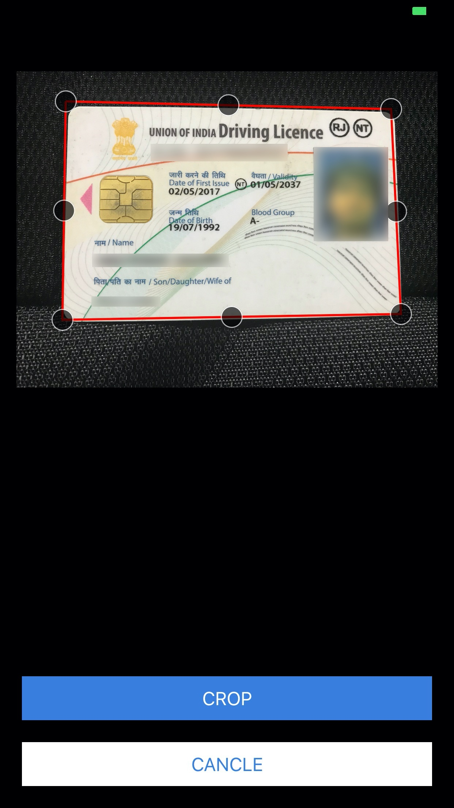

# DocumentCapture SDK

This SDK based on AVFoundationKit and OpenCV which is been created to scan, capture & crop the document.

- Capture Document from Front and Back
- Crop with Auto-Edge-Detection

Sole purpose of this SDK is to capture the snapshot of document via scan mode, even you get the functionality of auto-edge-detection, so that you can crop the images more accurately.

<b>You can achieve the functionality with easy integration of following steps:</b>

- Add the SDK to your project, don't forget to add add it in `Embedded Binaries`.

- `import DocumentCapture` in your `UIViewController` file where you want to use this feature.

- And instantiate the view with following code.

        if let vc = GuidanceViewController.storyboardInstance() {
            vc.frontNavTitle = "Front Scan"
            vc.frontTitle = "Scan the front"
            vc.frontMessage = "Please Scan the front of the document."
            vc.backEnable = captureBackToggle.isOn
            vc.passImage = { frontImage, backImage in
                self.dismiss(animated: true, completion: nil)

                // Play with frontImage and backImage here
                // Code Here
                // ...
                
           }
            let navVc = UINavigationController(rootViewController: vc)
            present(navVc, animated: true, completion: nil)
        }
 
 

  
  
Repeat the same procedure to capture the back of document as well.
  

---
 
<b>More Details( Sample Code Repository):</b>

You can also take help from github repository including the working demo of `DocumentCapture` SDK.

https://github.com/anandramdeo-df/df-documents

<b>Note:</b> Start the capture with turning `is capture back` ON/ OFF.
